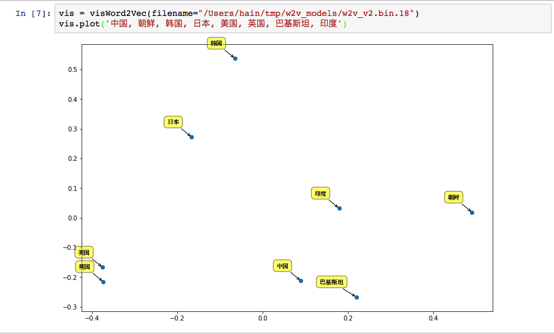

# word2vec-analysis
analysis word2vec model

# Welcome

# deps

[Jupyter Notebook](http://jupyter-notebook.readthedocs.io/en/latest/notebook.html)

[word2vec binding for Python(using Boost Python)](https://github.com/Samurais/word2vec_boostpython)

# references

[How is Principal Component Analysis used in Natural Language Processing?](https://www.quora.com/How-is-Principal-Component-Analysis-used-in-Natural-Language-Processing)

